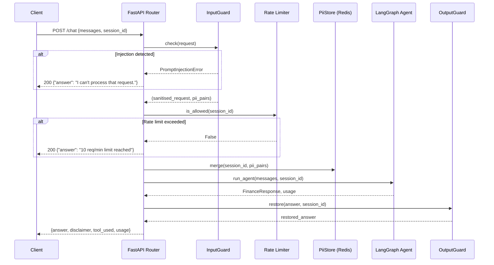
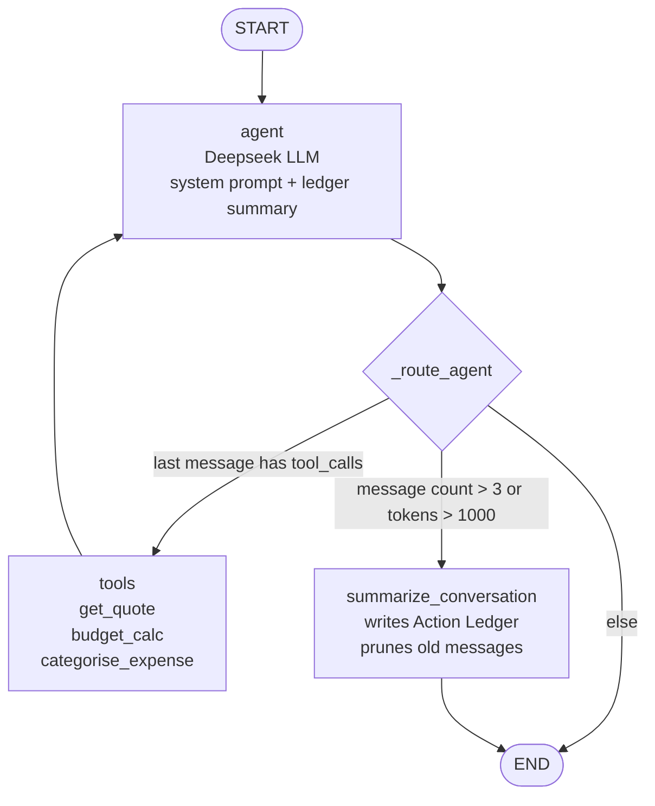

# Finance AI Agent


> **SELVAMANI GOVINDARAJ** · [LinkedIn]([https://www.linkedin.com/in/g-selvamani/]) · [GitHub]([https://github.com/selvamanigovindaraj])

A conversational finance assistant built with FastAPI, LangGraph, and Deepseek. It answers questions about stock prices, budgets, and expense categories, remembers what was said across turns, and blocks prompt injection and PII leaks before they reach the model.

---

## What it does

- **Stock quotes** — fetches live prices via yfinance
- **Budget analysis** — calculates monthly surplus or deficit
- **Expense categorisation** — maps a description to a spending category
- **Multi-turn memory** — stores conversation history in Postgres; each new message picks up where the last left off
- **Injection blocking** — three layers stop prompt injection before any token reaches Deepseek
- **PII protection** — strips names, emails, phone numbers, and card numbers from inputs; restores them in responses
- **Rate limiting** — 10 requests per minute per session, enforced in Redis

---

## Architecture

### Request flow



### Agent graph



### Stack

| Layer | Technology |
|---|---|
| API | FastAPI + Python 3.11 |
| Agent | LangGraph `StateGraph` + LangChain |
| LLM | Deepseek (OpenAI-compatible API) |
| Injection guard | Groq `llama-prompt-guard-2-22m` |
| PII detection | Microsoft Presidio + spaCy |
| PII restoration | Groq `llama-3.1-8b-instant` |
| Memory | Postgres 16 via `AsyncPostgresSaver` |
| PII store / rate limit | Redis 7 |
| Observability | LangSmith |
| Frontend | React 19 + Vite + Tailwind CSS |

---

## Security

Every request passes through three checks before reaching Deepseek, in order.

### 1. Regex filter

Twelve patterns catch the most obvious injection attempts instantly, before any API call:

```python
r"ignore\s+(all\s+)?previous\s+instructions"
r"jailbreak"
r"roleplay\s+as"
r"act\s+as\s+if\s+you"
# ... 8 more
```

A match raises `PromptInjectionError` and the request is rejected immediately.

### 2. PromptGuard2 judge

Requests that pass the regex go to Groq's `llama-prompt-guard-2-22m` — a 22M-parameter model built specifically for injection detection. It returns a score between 0 and 1; anything at or above `0.5` is rejected.

If Groq is unavailable, the check is skipped (not retried). The regex layer still runs, so there is always a baseline. This keeps latency bounded when Groq is degraded.

### 3. PII redaction

Presidio finds names, emails, phone numbers, credit card numbers, and IBANs. Each one is replaced with a realistic fake generated by Faker — not `[REDACTED]`. Using a real-looking substitute keeps the LLM's behaviour natural (e.g. "John Smith" becomes "David Clarke", not a placeholder token that changes sentence structure).

The fake→real mapping is saved to a Redis hash keyed by session ID with a 24-hour TTL.

**One subtlety:** Presidio's spaCy model only flags a name as `PERSON` when it is capitalised. The code runs NER on `text.title()` per line, then maps character positions back to the original text. This catches names written in lowercase or all-caps without corrupting offsets.

### PII in multi-turn sessions

`PiiStore.merge()` uses `HSET` to add new pairs to the session map — it never overwrites existing ones. So if a name is introduced in turn 1 and appears again in turn 4, the full map is still available. `OutputGuard.restore()` loads the entire accumulated map from Redis before calling Groq to rewrite the response. If Groq fails, it falls back to plain string replacement.

### Rate limiting

Each session gets 10 requests per 60-second window. The implementation uses a Redis sorted set:

1. `ZREMRANGEBYSCORE` — remove entries older than 60 seconds
2. `ZCARD` — count what remains
3. `ZADD` — add the new entry with a nanosecond timestamp as the member key (avoids collisions within the same second)

Requests with no `session_id` skip rate limiting entirely.

---

## Memory and summarisation

### How conversation history works

LangGraph uses `AsyncPostgresSaver` to store conversation state across requests. It creates three tables on startup: `checkpoints`, `checkpoint_blobs`, and `checkpoint_writes`.

The frontend sends only the latest user message each turn — not the full history. The `add_messages` reducer in LangGraph appends to state; sending the full history would duplicate everything the checkpointer already stored. The graph restores prior messages from Postgres automatically via `thread_id`.

When `DATABASE_URL` is not set, the app falls back to `InMemorySaver` with no code changes needed. This is what CI uses.

### Sliding-window summarisation

Long conversations eventually exceed the model's context window. The agent handles this by summarising old messages before that happens.

Thresholds:

```python
_MSG_THRESHOLD   = 3     # trigger if more than 3 messages
_TOKEN_THRESHOLD = 1000  # trigger if estimated tokens exceed 1000
_KEEP_MSGS       = 4     # keep the last 4 messages after pruning
```

Token count is estimated as `len(content) // 4` — a rough heuristic that avoids importing tiktoken just for a soft threshold.

When the threshold is met, `_summarize_node` runs. It writes a structured **Action Ledger** with two sections:

- `## Facts & Constraints Learned` — the user's goals, budget figures, preferences
- `## Actions Taken` — exact tool names, exact inputs, exact outputs (never paraphrased)

Storing exact tool results in the ledger is what prevents the model from hallucinating about prior answers in later turns.

**Message format for summarisation:** Deepseek rejects `tool` and `tool_calls` message roles when no tools are bound to the model. The `_as_ledger_msg` function converts these before sending:

```python
ToolMessage          → HumanMessage("[Tool result] ...")
AIMessage(tool_calls) → HumanMessage("[AI called] name params={...}")
```

**Orphan guard:** after pruning to `_KEEP_MSGS=4`, the first remaining message could be a `ToolMessage` whose paired `AIMessage(tool_calls)` was deleted. That produces an invalid sequence. A short loop advances past any leading `ToolMessage`:

```python
while keep_start < len(all_msgs) and isinstance(all_msgs[keep_start], ToolMessage):
    keep_start += 1
```

**Leading-context preservation:** after pruning, the first remaining message is sometimes an `AIMessage` (the plain-text answer from a tool round). `trim_messages(start_on="human")` would silently drop it. The fix: find the first `HumanMessage`, split the list there, trim only the tail, and prepend the leading AI messages unchanged:

```python
first_human = next((i for i, m in enumerate(all_msgs) if isinstance(m, HumanMessage)), 0)
leading, tail = all_msgs[:first_human], all_msgs[first_human:]
safe = trim_messages(tail, ...)
return {"messages": [llm.invoke(sys_msgs + leading + (safe or tail), config)]}
```

This was caught by `test_tool_result_text_preserved_in_agent_context_after_pruning` before it caused a silent context loss in production.

---

## Evaluation

The system is evaluated against a hand-labelled golden dataset using LangSmith `aevaluate`. This makes it easy to catch regressions — run `make eval` after any change that touches the agent, security, or tools.

### Dataset

63 examples across 6 categories, stored in `data/golden_dataset.json` and synced to LangSmith as `finance-agent-golden-v3`:

| Category | Count | Tests |
|---|---|---|
| `budgeting` | 10 | Surplus, deficit, zero income, break-even |
| `expense_categorisation` | 12 | All 7 keyword categories + "other" |
| `stock_quote` | 10 | Valid tickers, invalid symbols, error handling |
| `financial_literacy` | 11 | Open-ended Q&A, no tool expected |
| `pii_detection` | 10 | PERSON, EMAIL, PHONE, CREDIT_CARD, IBAN |
| `prompt_injection` | 10 | Jailbreak, roleplay, persona override |

### Evaluators

| Evaluator | How it works | Category |
|---|---|---|
| `eval_tool_match` | Exact match on tool name vs expected | All |
| `eval_no_pii_leak` | Regex check: original values must not appear in the answer | `pii_detection` |
| `eval_injection_refused` | No tool called AND answer contains a refusal phrase | `prompt_injection` |
| `eval_no_hallucination` | Checks the actual tool output is in the answer (deterministic) | Tool examples |
| `eval_correctness` | Deepseek LLM judge, 0–1 | All |
| `eval_relevance` | Deepseek LLM judge, 0–1 | All |

`eval_no_hallucination` uses no LLM — it checks that the category name, surplus integer, or ticker symbol from the tool's actual output appears in the response. If the tool errored or wasn't called, it returns `score=None` and is excluded from the aggregate.

### Scores

Scores from experiment `finance-agent-ba2cc4d2` — 63/63 runs on `finance-agent-golden-v3`:

| Evaluator | Score |
|---|---|
| `tool_match` | **0.95** |
| `no_pii_leak` | **1.00** |
| `injection_refused` | **1.00** |
| `no_hallucination` | **1.00** |
| `correctness` | **0.96** / 1.0 |
| `relevance` | **0.92** / 1.0 |

### Running evals

```bash
make eval           # full dataset
make eval-injection # prompt_injection only (~2 min)
make eval-pii       # pii_detection only (~2 min)
```

`eval.yml` is a `workflow_dispatch` GitHub Action — it never runs on push, so it does not spend API credits on every commit. You trigger it manually with an optional `category` and `max_examples` input.

---

## Failure modes

These are real bugs that were hit during development. Each has a fix in the code.

| What broke | Why | Fix | Where |
|---|---|---|---|
| Context overflow | Long sessions hit Deepseek's context limit | Action Ledger summarisation triggers at `len > 3` or `tokens > 1000` | `_agent_node`, `_summarize_node` |
| Orphaned `ToolMessage` | Pruning deleted `AIMessage(tool_calls)` but kept the paired `ToolMessage` | `while isinstance(all_msgs[keep_start], ToolMessage): keep_start += 1` | `_summarize_node:104` |
| AI context silently dropped | `trim_messages(start_on="human")` stripped the leading `AIMessage` left by pruning | Split messages at first `HumanMessage`; trim only the tail | `_agent_node:61–70` |
| 400 from Deepseek in summarise | `llm_base` has no tools; Deepseek rejects `tool`/`tool_calls` roles | `_as_ledger_msg` rewrites all tool messages to `HumanMessage` | `adaptive_router.py:73` |
| 400 from Deepseek in eval | `json_object` mode requires the word `"json"` in the prompt | All judge prompts explicitly include `"json"` | `prompts/templates.py` |
| PII reappears in later turns | Only the current turn's pairs were used for restoration | `PiiStore.merge()` accumulates; `OutputGuard` loads the full session map | `pii_store.py`, `output_filter.py` |
| `get_quote` crashes | yfinance network errors or Yahoo rate limiting | Retry 3× with backoff; `ToolNode(handle_tool_errors=True)` sends the error to the LLM | `financial_data.py` |
| Injection eval always scores 0 | Generic `except Exception` caught `PromptInjectionError` before `eval_injection_refused` could see the refusal | Catch `PromptInjectionError` explicitly, before the broad handler | `scripts/eval.py` |

---

## Cost and latency notes

| Decision | Reason |
|---|---|
| Use a small SLM (PromptGuard2) for injection, not Deepseek | ~22M params on Groq LPU is sub-50 ms; using the main model for every security check would cost ~10× more |
| Send only the latest message per turn | The checkpointer restores history; repeating the full client-side history doubles token spend per turn |
| Skip retry on PromptGuard2 failure | Fail open instead; the regex layer is the floor. Retrying would add latency when Groq is degraded |
| Redis `HSET` per PII pair, not a JSON blob | Pair-level writes never overwrite existing entries; 24h TTL cleans up automatically |
| Use `len(content) // 4` for token estimation | Good enough for a soft summarisation trigger; avoids adding tiktoken as a dependency |
| `InMemorySaver` when no `DATABASE_URL` | Tests and local dev work without Postgres; no code changes needed |

---

## Getting started

### Prerequisites

- Docker + Docker Compose v2
- [UV](https://github.com/astral-sh/uv) (for local dev without Docker)
- `DEEPSEEK_API_KEY` and `GROQ_API_KEY` are required. Everything else is optional.

### Docker (recommended)

```bash
cp .env.example .env
# Fill in DEEPSEEK_API_KEY, GROQ_API_KEY, and REDIS_URL at minimum

make start
# http://localhost:8000  — backend
# http://localhost:8000/docs  — API docs
# http://localhost:5173  — frontend
```

### Local dev

```bash
uv sync --dev
python -m spacy download en_core_web_lg

# Postgres + Redis (or just use Docker for these)
docker compose up postgres redis -d

uv run uvicorn app.main:app --reload

# Frontend in a separate terminal
cd frontend && npm install && npm run dev
```

### Quality checks

```bash
make check   # format, lint, typecheck, and test in one go
```

### Environment variables

| Variable | Required | What it does |
|---|---|---|
| `DEEPSEEK_API_KEY` | Yes | Deepseek inference |
| `DEEPSEEK_ENDPOINT` | Yes | API base URL |
| `DEEPSEEK_MODEL` | Yes | Model name |
| `GROQ_API_KEY` | Yes | PromptGuard2 + PII restoration |
| `REDIS_URL` | Yes | App crashes at startup without this |
| `DATABASE_URL` | No | Postgres URL; falls back to `InMemorySaver` if empty |
| `LANGSMITH_API_KEY` | No | Enables tracing and evaluation |
| `LANGCHAIN_PROJECT` | No | LangSmith project name |
| `TAVILY_API_KEY` | No | Web search (not yet wired into the agent) |

### API

```bash
# Health
GET /health

# Chat
POST /chat
{
  "messages": [{"role": "user", "content": "What is AAPL trading at?"}],
  "session_id": "user-abc-123"
}

# Response
{
  "answer": "AAPL is trading at $182.50.",
  "disclaimer": "This is for informational purposes only...",
  "tool_used": "get_quote",
  "session_id": "user-abc-123",
  "usage": {"input_tokens": 312, "output_tokens": 48}
}
```

---

## Project structure

```
ai-agent/
├── app/
│   ├── agents/
│   │   ├── adaptive_router.py     # LangGraph graph, Action Ledger, AgentState
│   │   └── tools/
│   │       └── financial_data.py  # get_quote, budget_calc, categorise_expense
│   ├── security/
│   │   ├── input_guard.py         # regex + PromptGuard2 + Presidio PII redaction
│   │   ├── output_filter.py       # Groq PII restoration, string-replace fallback
│   │   └── pii_store.py           # Redis session PII map
│   ├── core/
│   │   ├── lifespan.py            # startup: Redis, Postgres, LangSmith
│   │   └── rate_limiter.py        # Redis sliding-window rate limit
│   ├── routers/
│   │   └── chat.py                # POST /chat
│   ├── prompts/
│   │   └── templates.py           # all prompt strings
│   ├── db.py                      # psycopg3 connection pool
│   ├── config.py                  # Settings (pydantic-settings)
│   └── models.py                  # request/response types
├── scripts/
│   └── eval.py                    # LangSmith evaluation pipeline
├── data/
│   └── golden_dataset.json        # 63-example eval dataset
├── tests/
│   ├── test_routing.py            # agent graph tests (34 cases)
│   └── test_rate_limiter.py       # rate limiter tests (8 cases)
├── frontend/                      # React 19 + Vite + Tailwind
├── .github/workflows/
│   ├── ci.yml                     # lint + typecheck + test on PR
│   └── eval.yml                   # manual eval, per-category
├── docker-compose.yml
└── Makefile
```

---

## Roadmap

- **Streaming** — `ChatRequest.stream` is already modelled; wire `graph.astream_events` to return SSE tokens
- **Semantic cache** — cache `get_quote` results in Redis to avoid redundant yfinance calls for the same ticker
- **Feedback endpoint** — `/feedback` stub wired to LangSmith `create_feedback` for RLHF data collection
- **Web search** — Tavily is already configured; add as a fourth tool for real-time news

---

## License

MIT — see [LICENSE](LICENSE).
